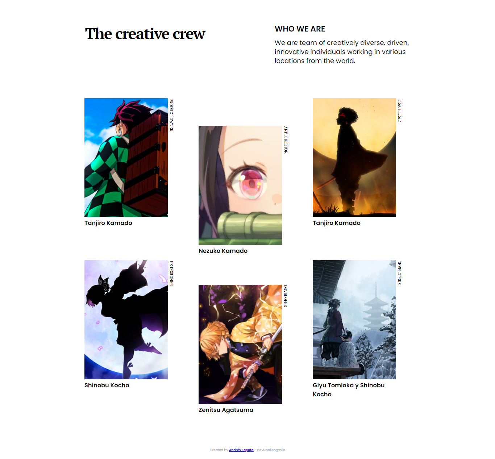

<!-- Please update value in the {}  -->

<h1 align="center">My-Team-Page</h1>

   Solution for a challenge from  <a href="http://devchallenges.io" target="_blank">Devchallenges.io</a>.

  <h3>
    <a href="https://blackfenix07.github.io/My-Team-Page/"> 
      Demo
    </a>
     | 
    <a href="https://github.com/BlackFenix07/My-Team-Page">
      Solution
    </a>
     | 
    <a href="https://devchallenges.io/challenges/wBunSb7FPrIepJZAg0sY">
      Challenge
    </a>
  </h3>

<!-- TABLE OF CONTENTS -->

## Table of Contents

- [Overview](#overview)
  - [Built With](#built-with)
- [Features](#features)
- [Contact](#contact)
- [Acknowledgements](#acknowledgements)

<!-- OVERVIEW -->

## Overview

Introduce your projects by taking a screenshot or a gif. Try to tell visitors a story about your project by answering:

- Where can I see your demo?
  You can see a demo of my project at https://blackfenix07.github.io/My-Team-Page/
- What was your experience?
  My experience has been quite good and productive since I was able to complete the proposed challenge.
- What have you learned/improved?
  I have learned to write HTML, CSS and CCS Grid Layout code in a more agile and comfortable way.

### Built With

<!-- This section should list any major frameworks that you built your project using. Here are a few examples.-->

- [HTML](https://developer.mozilla.org/es/docs/Web/HTML)
- [CSS](https://developer.mozilla.org/es/docs/Web/CSS)
- [CSS Grid Layout](https://developer.mozilla.org/es/docs/Web/CSS/CSS_Grid_Layout)

## Features

<!-- List the features of your application or follow the template. Don't share the figma file here :) -->

This application/site was created as a submission to a [DevChallenges](https://devchallenges.io/challenges) challenge. The [challenge](https://devchallenges.io/challenges/wBunSb7FPrIepJZAg0sY) was to build an application to complete the given user stories.

## Acknowledgements

<!-- This section should list any articles or add-ons/plugins that helps you to complete the project. This is optional but it will help you in the future. For exmpale -->

- [HTML](https://developer.mozilla.org/es/docs/Web/HTML)
- [CSS](https://developer.mozilla.org/es/docs/Web/CSS)
- [CSS Grid Layout](https://developer.mozilla.org/es/docs/Web/CSS/CSS_Grid_Layout)
- [devChallenges.io](https://devchallenges.io/)

## Contact

- GitHub [BlackFenix07](https://github.com/BlackFenix07)